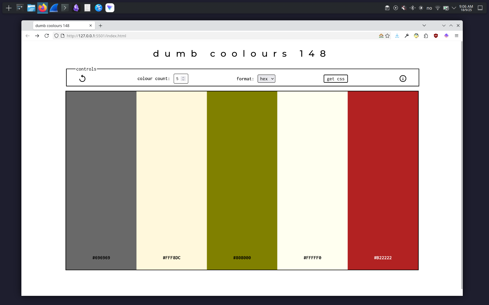

# dumb coolors

## about

Kinda like "coolor.co"<sup>[1](#fn1)</sup> but with only the 140<sup>[2](#fn2)</sup> supported by all browers<sup>[3](#fn3)</sup>.

## the process

extract list of colours (names and hex) from w3schools site.

- so get the text like
```
curl https://www.w3schools.com/colors/colors_names.asp -o w3schools_site.html
```

- parse the html and extract the colour names and corresponding hex codes.

- load these into the script.

- on press of spacebar randomly select from the list and display.

so there's actually two little projects here. a html parser and simple site.

ended up using some perl libraries to simplify the first part.

second project was a good exercise in basic javascript and (modernised
approach to) css.

# sample



## TODO

- host it
- docstrings \& comments

## references \& notes

<a name="fn1">1<a>: https://coolors.co/generate

<a name="fn2">2</a>: actually 148 by my count, however there are some duplicates arising from american vs english
spelling *e.g.* `grey` or `gray`, plus the corresponding shades may bring it
down to 140, i haven't checked.

<a name="fn3">3</a>: https://www.w3schools.com/colors/colors_names.asp

